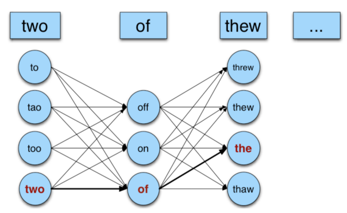

    <h1 align="center">Real-word Spell Correction </h1>

 

Errors in sentence can be of two types: Individual word errors and errors in a sentence. An aritle related to this work written by me can be found [here](https://medium.com/analytics-vidhya/real-word-spell-correction-c64a3a02c64d)

## Word-level Correction
An error at word level can be identified if the word does not exist in dictionary. A metric like Edit Distance can be used to find nearest words from the dictionary to the misspelt word. Another metric like Weighted Edit Distance can also be used.

## Sentence Correction
If all the words in a sentece are present in dictionary but don't match the context, it is a real-word error. All possible candidates (words at edit distance 1 from given word) are considered. Using a bigram language model, the probabilities of candidate senetences is calculated.  

    

